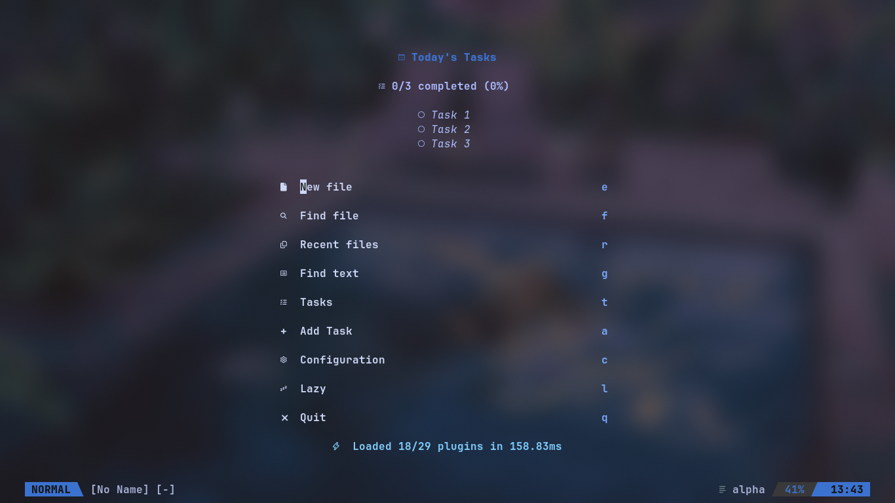
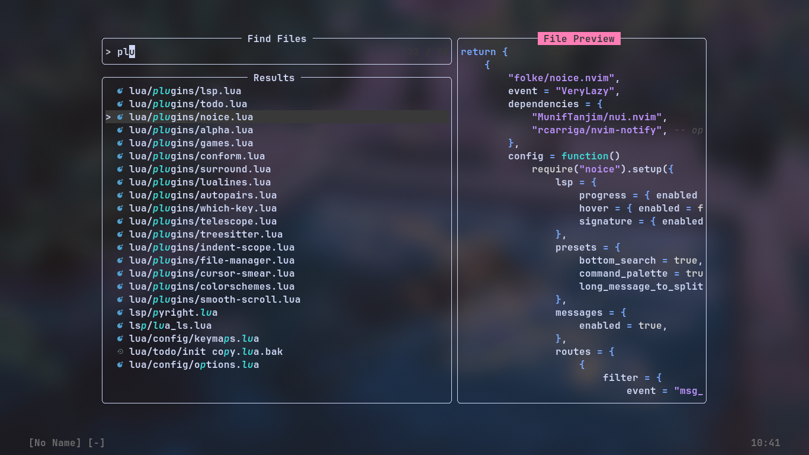
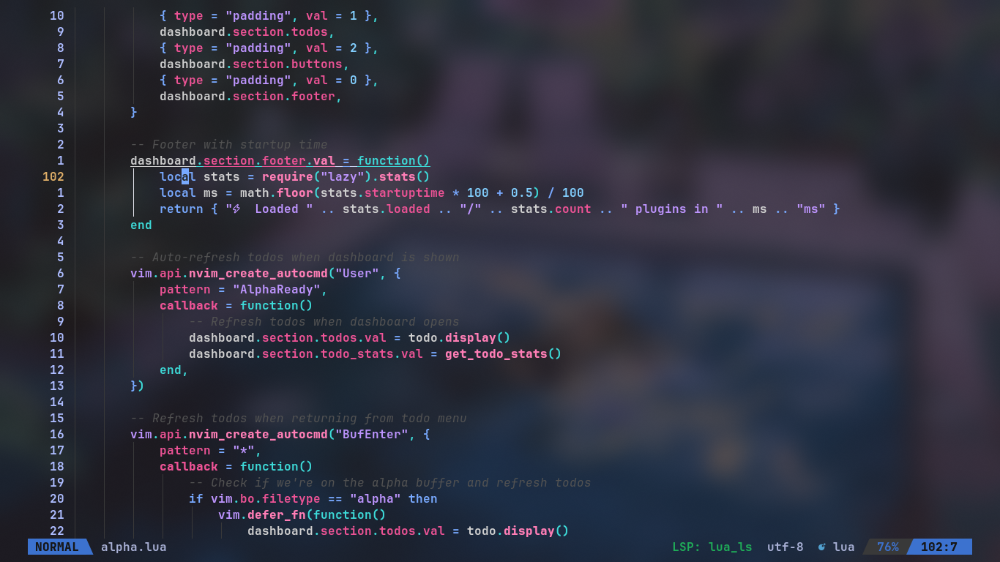

> [!NOTE]
*This config is tailored for my personal workflow, but feel free to use it as a starting point for your own setup.*

## Installation

1.  **Backup your current nvim config:**
    ```bash
    mv ~/.config/nvim ~/.config/nvim.bak
    ```

2.  **Clone the repository:**
    ```bash
    git clone https://github.com/dheeman/nvim-config.git ~/.config/nvim
    ```

3.  **Install dependencies:**
    Make sure you have `ripgrep`, `yazi` and `fd` installed.
    - `ripgrep` is used by `telescope.nvim` for `live_grep`.
    - `fd` and `yazi` is used by `yazi.nvim`.


4.  **Set Nerd Font:**
    For the icons to render correctly, please set a [Nerd Font](https://www.nerdfonts.com/) in your terminal.

## Screenshots




